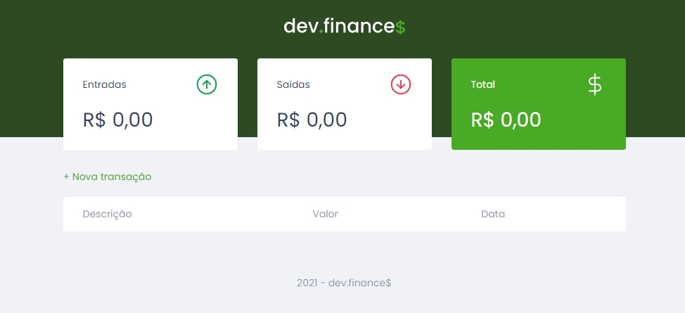
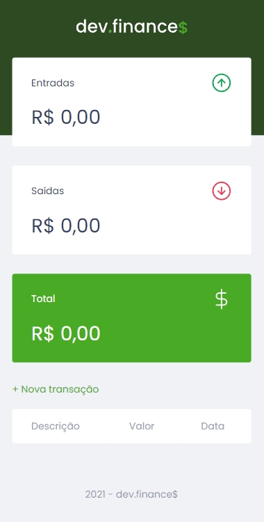
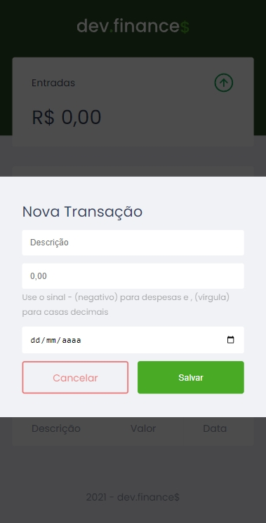

<h1 align="center">
    
</h1>

  :white_check_mark: <a href="https://andreadcsousa.github.io/rocketseat_devfinances-discover/" target="_blank">Veja a página</a>
 &nbsp;&nbsp;&nbsp; | &nbsp;&nbsp;&nbsp;
  :white_check_mark: <a href="https://rocketseat.com.br/" target="_blank">Conheça a Rocketseat</a>

# :computer: Projeto
 
- Idealizador: Rocketseat
- Projeto: dev.finance$
- Lado da força: Front-End
- Tipo: Desafios Discover
- Etapa: Desafio DevFinance

# :rocket: Tecnologias

# :package: Recursos

### Document Object Model (DOM):

# :art: Layout PC

# :iphone: Layout Mobile

 
